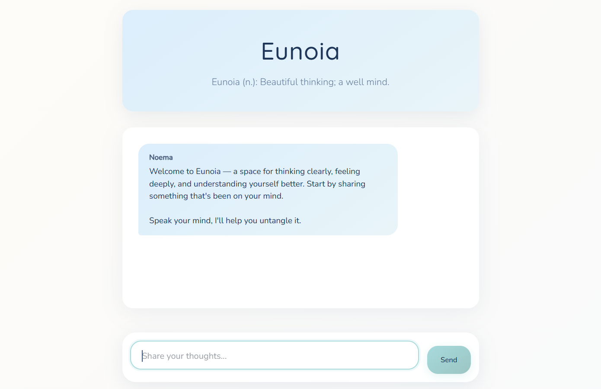

<a id="readme-top"></a>
<!--
*** ReadMe template from Othneil Drew @othneildrew on GitHub
-->
<!-- [![project_license][license-shield]][license-url]
[![LinkedIn][linkedin-shield]][linkedin-url] -->


<!-- PROJECT LOGO -->
<br />
<div align="center">
  <a href="https://github.com/alvagarciia/eunoia">
    
  </a>

<h3 align="center">Eunoia</h3>

  <p align="center">
    Psychologist-inspired AI chatbot
    <br />
    <br />
    <a href="https://github.com/alvagarciia/eunoia/issues/new?labels=bug&template=bug-report---.md">Report Bug</a>
    &middot;
    <a href="https://github.com/alvagarciia/eunoia/issues/new?labels=enhancement&template=feature-request---.md">Request Feature</a>
  </p>
</div>


<!-- TABLE OF CONTENTS -->
<details>
  <summary>Table of Contents</summary>
  <ol>
    <li>
      <a href="#about-the-project">About The Project</a>
      <ul>
        <li><a href="#features">Features</a></li>
        <li><a href="#built-with">Built With</a></li>
      </ul>
    </li>
    <li>
      <a href="#getting-started">Getting Started</a>
      <ul>
        <li><a href="#prerequisites">Prerequisites</a></li>
        <li><a href="#installation">Installation</a></li>
      </ul>
    </li>
    <li>
      <a href="#usage">Usage</a>
      <ul>
        <li><a href="#demo">Demo</a></li>
      </ul>
    </li>
    <li><a href="#contributing">Contributing</a></li>
    <li><a href="#license">License</a></li>
    <li><a href="#contact">Contact</a></li>
  </ol>
</details>


<!-- ABOUT THE PROJECT -->
## About The Project



Eunoia is a psychology-inspired AI assistant designed to guide users through thoughtful self-reflection and emotional understanding. It provides a calm, nonjudgmental space to talk about personal concerns, helping users gain insight through conversation.

Eunoia (from the Greek word meaning "beautiful thinking") is designed as a minimal, calming environment where users feel safe sharing thoughts or emotions. With roots in therapy-inspired dialogue, it mimics a structured self-exploration process guided by a supportive AI persona called **Noema**.

The app guides users through:

1. Sharing a concern
2. Clarifying questions
3. Identifying underlying patterns
4. Reflecting on emotional insights
5. Summarizing findings (if asked to)

It does not replace therapy, but offers a warm digital space for introspection.

<p align="right">(<a href="#readme-top">back to top</a>)</p>


### Features

- Minimalist, mobile-friendly chat interface
- Assistant responds as **Noema**, a professional and curious guide
- Session-based memory for continuity of thought during chats
- Automatically resets memory on page reload
- Styled interface with relaxing color palette
- Mindful prompt engineering to prevent unwanted injection 

<p align="right">(<a href="#readme-top">back to top</a>)</p>


### Built With

[![Flask][flask]](https://flask.palletsprojects.com/en/stable/)
[![OpenAI][openai]](https://github.com/openai)
[![LangChain][langchain]](https://github.com/langchain-ai/langchain)
[![Render][render]](https://github.com/renderinc)

<p align="right">(<a href="#readme-top">back to top</a>)</p>


<!-- GETTING STARTED -->
## Getting Started

To get a local copy up and running follow these simple example steps.

### Prerequisites

* Python
  ```sh
  pyenv install python-3.11.8
  ```

### Installation

1. Get an API Key at [https://platform.openai.com](https://platform.openai.com/api-keys)
2. Clone the repo
   ```sh
   git clone https://github.com/alvagarciia/eunoia.git
   ```
3. Create a virtual environment
   >  Recommended to avoid dependency conflicts
   ```sh
   python -m venv venv
    source venv/bin/activate    # Mac/Linux
    venv\Scripts\activate       # Windows
   ```
4. Install dependencies
   ```sh
   pip install -r requirements.txt
   ```
5. Create a `.env` file and enter your API key there
   ```js
   OPENAI_API_KEY = yourAPIKey;
   ```
6. Change git remote url to avoid accidental pushes to base project
   > Only necessary if you forked or cloned this project to make your own version
   ```sh
   git remote set-url origin github_username/eunoia
   git remote -v # confirm the changes
   ```
7. Run app locally
   ```sh
   python run.py
   ```
   Visit `localhost:5000` in your browser.

<p align="right">(<a href="#readme-top">back to top</a>)</p>


<!-- USAGE EXAMPLES -->
## Usage

Once started, users can visit the app and begin chatting with Noema. No signup required. Each new page load starts a fresh session.

Noema will only answer to problems that the user shares and ask questions back so that the user can do introspection. Whenever the user shows signs of being satisfied with the conversation, Noema will offer to write a short summary of the chat.

The prompt engineering made it so that sending more messages and increasing the conversation doesn't increase the cost exponentially. However, inputting longer texts WILL use up more tokens. 

<p align="right">(<a href="#readme-top">back to top</a>)</p>


### Demo


<p align="right">(<a href="#readme-top">back to top</a>)</p>


<!-- CONTRIBUTING -->
## Contributing

Contributions are what make the open source community such an amazing place to learn, inspire, and create. Any contributions you make are **greatly appreciated**.

If you have a suggestion that would make this better, please fork the repo and create a pull request. You can also simply open an issue with the tag "enhancement".
Don't forget to give the project a star! Thanks again!

1. Fork the Project
2. Create your Feature Branch (`git checkout -b feature/AmazingFeature`)
3. Commit your Changes (`git commit -m 'Add some AmazingFeature'`)
4. Push to the Branch (`git push origin feature/AmazingFeature`)
5. Open a Pull Request

<p align="right">(<a href="#readme-top">back to top</a>)</p>


<!-- LICENSE -->
## License

Distributed under the MIT License. See `LICENSE` for more information.

<p align="right">(<a href="#readme-top">back to top</a>)</p>


<!-- CONTACT -->
## Contact

Alvaro Garcia - [LinkedIn @alvaro-garciam](https://www.linkedin.com/in/alvaro-garciam) - alvaroedgamu@gmail.com

Project Link: [https://github.com/alvagarciia/eunoia](https://github.com/alvagarciia/eunoia)

<p align="right">(<a href="#readme-top">back to top</a>)</p>


<!-- MARKDOWN LINKS & IMAGES -->
<!-- https://www.markdownguide.org/basic-syntax/#reference-style-links -->
[license-shield]: https://img.shields.io/github/license/alvagarciia/eunoia.svg?style=for-the-badge
[license-url]: https://github.com/alvagarciia/eunoia/blob/main/LICENSE
[linkedin-shield]: https://img.shields.io/badge/-LinkedIn-black.svg?style=for-the-badge&logo=linkedin&colorB=555
[linkedin-url]: https://linkedin.com/in/alvaro-garciam


[flask]: https://img.shields.io/badge/Flask-6BB5D7?style=for-the-badge&logo=flask&logoColor=white
[openai]: https://img.shields.io/badge/OpenAI-0f9e7b?style=for-the-badge&logo=openai&logoColor=white
[langchain]: https://img.shields.io/badge/LangChain-1C3C3C?style=for-the-badge&logo=langchain&logoColor=white
[render]: https://img.shields.io/badge/Render-8A05FF?style=for-the-badge&logo=render&logoColor=white